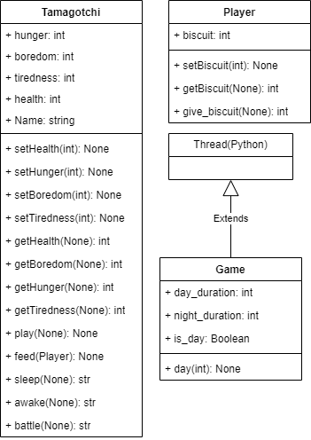

# Tamagotchi-Project
``` python
    Python Version : 3.12.1
```
# Works on this Repo
## 1 - Clone the repo
```cmd
git clone https://github.com/Cavernos/Tamagotchi-Project.git
```

## 2 - Create a Virtual Environment
```cmd
python -m venv venv
```
## 3 - Install dependencies
```cmd
python -m pip install -e .
```
## 4 - Install dev dependencies 
```cmd
python -m pip install -e .[dev]
```
## 5 - Install test dependencies 
```cmd
python -m pip install -e .[test]
```
## 5 - Run Unit Tests
```cmd
pytest
```

# Idea

- Api RestFul
- Application GUI
- site web

# Class Diagram
